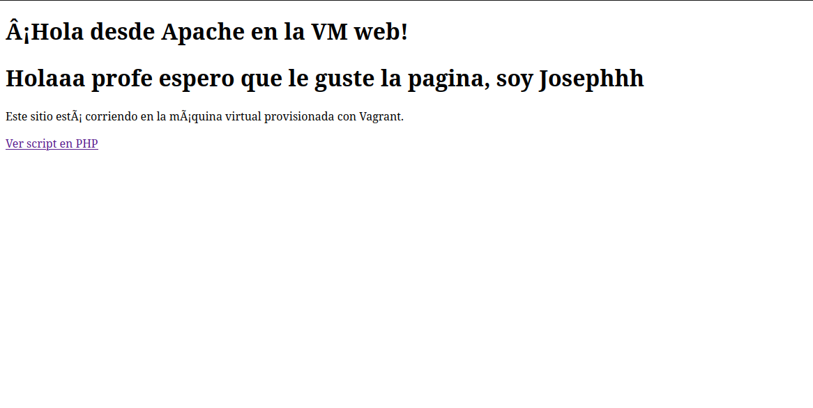
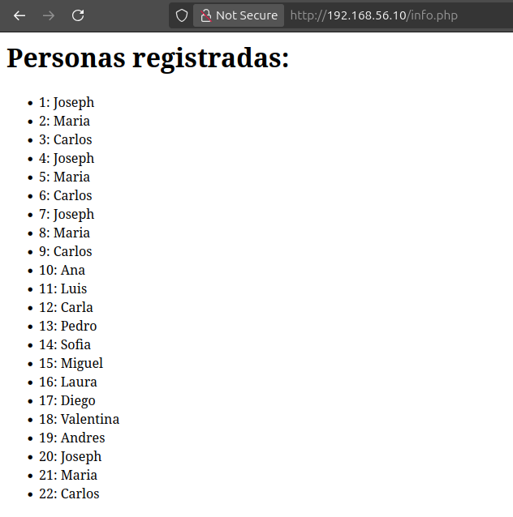

# Taller Vagrant + Provisionamiento con Shell

## Pasos
1. Clonar este repositorio.
2. Ejecutar `vagrant up` para levantar las máquinas.
3. Acceder a la máquina web en: http://192.168.56.10
4. Verificar `index.html` y `info.php`.

## Reto
- Completar `provision-db.sh` para instalar PostgreSQL.
- Crear una base de datos y tabla.
- Conectar la página PHP a la base de datos y mostrar datos.

## Paginas web accedibles:
-> http://192.168.56.10 #Esto es la ip para acceder
-> http://192.168.56.10/index.html #Pagina web de prueba de Apache
-> http://192.168.56.10/info.php #Pagina web con la base de datos de PostgreSQL

## Para el retico

Creamos una tabla llamada "personas"

CREATE TABLE personas (
    id SERIAL PRIMARY KEY,
    nombre VARCHAR(50)
);

## Ejemplo de datos

INSERT INTO personas (nombre) VALUES 
('Joseph'), ('Maria'), ('Carlos'), 
('Ana'), ('Luis'), ('Carla'), ('Pedro'), 
('Sofia'), ('Miguel'), ('Laura'), 
('Diego'), ('Valentina'), ('Andres');

## Y tenemos que otorgar todos los permisos al usuario (en mi caso) Joseph, de lo contrario, no se mostrara la tabla en la pagina debido a un error de permisos

GRANT ALL PRIVILEGES ON TABLE personas TO joseph;

## Modificamos tanto como provision-db.sh y info.php para hacer la correcta conexion con las base de datos

# info.php

<?php
$host = "192.168.56.11"; // IP de la VM db
$dbname = "mi_base";
$user = "joseph";
$password = "1234";

$conn = pg_connect("host=$host dbname=$dbname user=$user password=$password");

if(!$conn){
    echo "Error de conexión a la base de datos.";
} else {
    echo "<h1>Personas registradas:</h1>";
    $result = pg_query($conn, "SELECT * FROM personas");
    echo "<ul>";
    while($row = pg_fetch_assoc($result)){
        echo "<li>".$row['id'].": ".$row['nombre']."</li>";
    }
    echo "</ul>";
}
?>

# provision-db.sh

#!/bin/bash
sudo apt update -y
sudo apt install -y postgresql postgresql-contrib

# Crear base de datos y usuario
sudo -i -u postgres psql -c "CREATE DATABASE mi_base;"
sudo -i -u postgres psql -c "CREATE USER joseph WITH ENCRYPTED PASSWORD '1234';"
sudo -i -u postgres psql -c "GRANT ALL PRIVILEGES ON DATABASE mi_base TO joseph;"

# Crear tabla y datos de ejemplo
sudo -i -u postgres psql -d mi_base -c "CREATE TABLE personas (id SERIAL PRIMARY KEY, nombre VARCHAR(50));"
sudo -i -u postgres psql -d mi_base -c "INSERT INTO personas (nombre) VALUES ('Joseph'), ('Maria'), ('Carlos');"

## Scripts de provisionamiento

## provision-web.sh

Instala Apache y PHP.

Instala la extensión php-pgsql.

Configura Apache para servir /var/www/html.

## provision-db.sh

Instala PostgreSQL y PostgreSQL contrib.

Crea la base de datos mi_base.

Crea el usuario joseph con contraseña 1234.

Crea la tabla personas y agrega los datos de ejemplo.

Otorga permisos al usuario joseph sobre la tabla.

Configura PostgreSQL para aceptar conexiones desde la red privada.

## Si se hace algun cambio por el mas minimo que sea hay que reprovisionar los scripts

vagrant provision db
vagrant provision web

## Y reiniciar apache si cambiamos el php

vagrant ssh web
sudo systemctl restart apache2

## Capturas de pantalla

**index.html:**

**info.php mostrando los registros de personas:**

